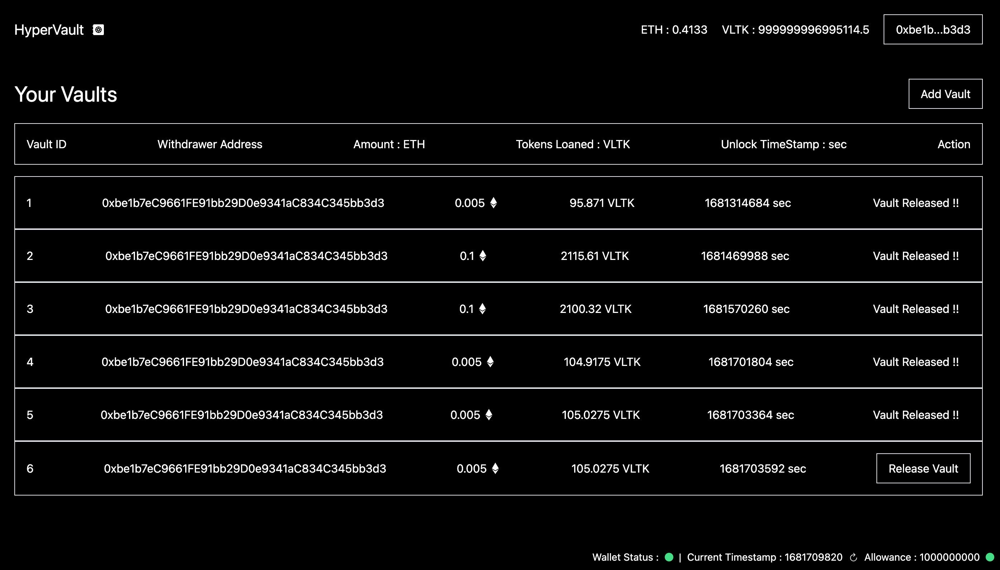

# CryptoVault 🔐

CryptoVault is a vault on blockchain in which we can deposit our funds and then we can withdraw them in exchange of the stable coins which we got in exchange of the amount we staked in the vault.

**How crypto vaults works ?**

```txt

Time T1 (initial time) :
----------------------

User : 500 XYZ (2 VLTK = 1 XYZ)

          $CRYPTO$
[USER] -------------> [Vault]
       <-------------
          $VLTK$

User : 1000 STABLECOIN (Asset returned by vault in exchange of the deposits as stable crypto)

Time T2 (after sometime) :

------------------------

User : 1000 STABLECOIN (Asset submitted to vault to get the deposited assets back which have higher value now)

          $VLTK$
[USER] ------------> [Vault]
       <------------
          $CRYPTO$

User : 500 XYZ (2.75 VLTK = 1 XYZ)

Value before lock : 1000 $VLTK$
Value after lock : 1375 $VLTK$

Profit % : (375 / 1000) * 100 = 37.5 %

CONCLUSION
----------

Here user had a profit and now owns much more worth of crypto that he/she/they owned it at time T1.

```

## Currencies Supported

The Vault supports ETH network and soon will support Cross chain.

```sh
-----------------------------------------------------------
| DEPLOYED   : 0x96dA2E1A6e5FFAcf6d5bbAf55091A67caba5DC2e |
| VLTK Token : 0x0EA7bf5f7Afd9f4c176F1E9083595A8e06b06454 |
-----------------------------------------------------------

# Address of price feeds
ETH_PRICE_FEED = 0x694AA1769357215DE4FAC081bf1f309aDC325306 
```

## Screenshots

</img>

## How to run

```sh
cd frontend
yarn
yarn dev
```
